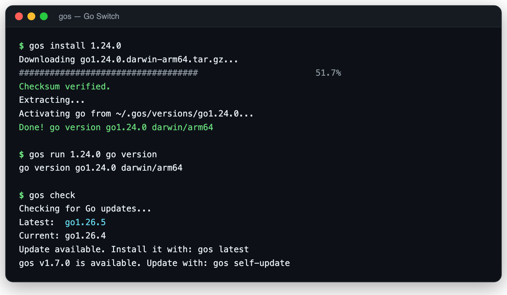

<p align="center">
  <h1 align="center">gos</h1>
  <p align="center">
    <strong>Install and switch Go versions in seconds. One script. Zero dependencies.</strong>
  </p>
  <p align="center">
    <a href="https://github.com/johnny4young/gos/releases"></a>
    <a href="https://github.com/johnny4young/gos/blob/main/LICENSE"></a>
    
    
    <a href="https://github.com/johnny4young/gos/stargazers"></a>
  </p>
</p>

---

<p align="center">
  
</p>

---

## Why gos?

You're on Go 1.19. Your project needs 1.22. You just want to switch — not install a version manager that itself needs managing.

**gos** (Go Switch) is a single Bash script that installs and switches Go versions. That's it. No runtimes, no plugins, no config files. It downloads the official binary from [go.dev](https://go.dev/dl/), puts it in place, and gets out of your way.

```bash
gos latest        # installs the latest stable Go
gos install 1.21  # installs a specific version
gos use           # installs the version requested by the current project
gos doctor        # checks your local setup
gos current       # shows what you're running
```

Compare that to the manual way: visit go.dev, find the right archive for your OS and arch, download it, remove the old install, extract, verify. **gos does all of that in one command.**

Works on **macOS**, **Linux**, and **Windows** (via Git Bash or WSL). Auto-detects your OS and CPU architecture. Requires nothing but `curl` and `bash`.

---

## Table of Contents

- [Quick Start](#quick-start)
- [Features](#features)
- [Prerequisites](#prerequisites)
- [Installation](#installation)
  - [curl | bash](#curl--bash)
  - [Homebrew](#homebrew-macos--linux)
  - [PowerShell](#powershell-windows)
  - [Windows Package Managers](#windows-package-managers)
  - [Git Clone](#git-clone)
  - [Manual Shell Config](#manual-shell-configuration)
- [Usage](#usage)
- [Shell Completions](#shell-completions)
- [Configuration](#configuration)
- [How It Works](#how-it-works)
- [Uninstallation](#uninstallation)
- [Security](#security)
- [Contributing](#contributing)
- [Releasing](#releasing)
- [License](#license)

---

## Quick Start

```bash
# Install gos
curl -fsSL https://github.com/johnny4young/gos/releases/latest/download/install.sh | bash

# Install the latest stable Go
gos latest
```

Done. That's the whole setup.

---

## Features

- **One command to latest Go** — `gos latest` fetches and installs the newest stable release
- **Pin any version** — `gos install 1.21.6` gets exactly what you need; `gos install 1.21` resolves to the newest patch release
- **Run without switching** — `gos run 1.21 go test ./...` runs a command with a side-by-side Go version without changing the active one
- **Project-aware switching** — `gos use` reads `.go-version`, `.tool-versions`, `toolchain`, or `go` directives
- **Update checks** — `gos check` reports whether newer stable Go or `gos` releases are available without installing anything
- **Doctor diagnostics** — `gos doctor` checks Go, PATH, permissions, checksum tools, and extraction tools; `gos doctor --fix` applies only safe, non-destructive fixes
- **Offline status dashboard** — `gos status` summarizes the active Go, project manifest, rollback, cache, and layout without network access
- **Cache and rollback** — verified archives are cached, `gos rollback` restores the previous install, and `gos prune` reclaims the disk space
- **Concurrent-operation guard** — mutating commands take a portable `.gos-lock` so overlapping installs fail fast instead of racing
- **Side-by-side versions (opt-in)** — set `GOS_VERSIONS_DIR` and every version stays installed; switching becomes an instant symlink flip, with `gos list --installed` and `gos uninstall`
- **Shell setup in one line** — `eval "$(gos env)"` puts the managed Go on PATH
- **Opt-in auto-switching** — `eval "$(gos env --auto)"` switches this shell to installed project versions as you `cd`, without changing global symlinks
- **Self-updating** — `gos self-update` upgrades gos itself from the latest verified release
- **Mirror support** — `GOS_DOWNLOAD_MIRROR` downloads archives from an HTTPS mirror while still verifying official go.dev checksums
- **TTY download progress** — interactive installs show archive progress while pipes, CI, and JSON stay quiet
- **TTY diagnostics styling** — interactive `gos doctor` plus stderr `Error:`/`Warning:` lines use color and symbols; pipes, `NO_COLOR`, `GOS_NO_COLOR=1`, and JSON stay plain
- **Machine-readable output** — `--json` is available for `check`, `current`, `list`, `platforms`, `status`, `which`, `doctor`, `prune`, and `version`
- **Auto-detects everything** — OS (`darwin`, `linux`, `windows`) and architecture (`amd64`, `arm64`, `armv6l`, `386`)
- **Cross-platform** — macOS, Linux, and Windows (Git Bash / WSL)
- **Zero dependencies** — just `curl` and `bash`, both pre-installed on most systems
- **Shell completions** — tab-completion for Bash, Zsh, and Fish, including dynamic installed/cached version suggestions and `gos completions <shell>` for single-file installs
- **Lightweight** — single shell script, no compilation, no runtime

---

## Prerequisites

| Requirement | Notes |
|---|---|
| `bash` | Pre-installed on macOS and Linux. Use [Git Bash](https://gitforwindows.org/) on Windows. |
| `curl` or `wget` | `curl` is pre-installed on most systems. `wget` is used as fallback. |
| `tar` / `unzip` | `tar` for macOS/Linux, `unzip` for Windows. |
| `sudo` | Required for the default install path (`/usr/local/go`). Not needed if you override `GOS_INSTALL_DIR`. |
| `jq` or `python3` (optional) | Enables SHA256 checksum verification after download. `python3` is pre-installed on macOS. |

> **Windows users:** install with PowerShell or Git Bash. The installed `gos`
> command runs through Git Bash today, so install [Git for Windows](https://gitforwindows.org/)
> or use WSL before running `gos`.

---

## Installation

Choose the method that fits your setup.

### curl | bash

The fastest way to get started:

```bash
curl -fsSL https://github.com/johnny4young/gos/releases/latest/download/install.sh | bash
```

This downloads the latest published `gos` release and places it in `/usr/local/bin`.
The release installer pins the downloaded script to the release asset checksum.
You can customize the location. The installer creates the target directory when
possible:

```bash
curl -fsSL https://github.com/johnny4young/gos/releases/latest/download/install.sh | GOS_BIN_DIR="$HOME/.local/bin" bash
```

If you intentionally want the unreleased development version from `main`, use
the raw GitHub installer instead. This skips the release-pinned checksum path and
should only be used for testing unreleased changes.

```bash
curl -fsSL https://raw.githubusercontent.com/johnny4young/gos/main/install.sh | bash
```

### Homebrew (macOS / Linux)

```bash
brew install johnny4young/tap/gos
```

To upgrade when a new version is released:

```bash
brew upgrade gos
```

> The formula lives in the [johnny4young/homebrew-tap](https://github.com/johnny4young/homebrew-tap) tap and is updated automatically on each release. If you previously installed from the old `johnny4young/gos` tap, Homebrew migrates you to the new tap automatically on your next `brew update` — nothing to do.

### PowerShell (Windows)

PowerShell is the primary Windows install path. Starting with the first release
that ships `install.ps1`, use:

```powershell
irm https://github.com/johnny4young/gos/releases/latest/download/install.ps1 | iex
```

The installer places `gos` in `%LOCALAPPDATA%\Programs\gos`, adds that directory
to your user `PATH`, verifies the release package checksum when installed from a
release asset, and warns if Git Bash is not available. It does not install Go;
after installing `gos`, run `gos latest` or `gos install <version>` when you want
to install a Go toolchain.

To update `gos`, run the same PowerShell installer again:

```powershell
irm https://github.com/johnny4young/gos/releases/latest/download/install.ps1 | iex
```

For development testing before that release asset exists:

```powershell
irm https://raw.githubusercontent.com/johnny4young/gos/main/install.ps1 | iex
```

### Windows Package Managers

Chocolatey and Winget are planned package-manager channels for Windows users,
but PowerShell is the canonical Windows installer first. Their metadata is
maintained under `packaging/` so future package-manager submissions can reuse
the same Windows release asset.

The public `choco install` and `winget install` commands are intentionally not
listed here yet. They should be added only after the packages are accepted by
their registries, so users do not copy commands that fail. Until then, use the
PowerShell installer, Git Bash, or WSL.

### Git Clone

```bash
git clone https://github.com/johnny4young/gos.git ~/.gos
ln -sf "$HOME/.gos/gos.sh" "$HOME/.gos/gos"
```

Then add to your shell profile (see [Manual Shell Configuration](#manual-shell-configuration)):

```bash
export PATH="$HOME/.gos:$PATH"
```

### Manual Shell Configuration

Homebrew installs completion files automatically. For `curl | bash`,
PowerShell, Windows package-manager, or git-clone installs, use the embedded
completion scripts printed by `gos completions <shell>`.

If you installed via git clone, keep the cloned command on `PATH` first:

```bash
export PATH="$HOME/.gos:$PATH"
```

Then add the completion setup for your shell.

**Bash** (`~/.bashrc`):

```bash
mkdir -p "${XDG_CACHE_HOME:-$HOME/.cache}/gos"
gos completions bash > "${XDG_CACHE_HOME:-$HOME/.cache}/gos/gos.bash"
source "${XDG_CACHE_HOME:-$HOME/.cache}/gos/gos.bash"
```

**Zsh** (`~/.zshrc`):

```zsh
mkdir -p "${ZDOTDIR:-$HOME}/.zsh/completions"
gos completions zsh > "${ZDOTDIR:-$HOME}/.zsh/completions/_gos"
fpath=("${ZDOTDIR:-$HOME}/.zsh/completions" $fpath)
autoload -Uz compinit && compinit
```

**Fish** (`~/.config/fish/config.fish`):

```fish
gos completions fish | source
```

After editing, reload your shell:

```bash
source ~/.bashrc   # or ~/.zshrc
exec fish          # for Fish
```

---

## Usage

<!-- gos-commands:begin -->
| Command | Description |
|---|---|
| `gos latest` | Install the latest stable Go version |
| `gos install <version>` | Install a specific Go version |
| `gos run <version> [--] <command> [args...]` | Run a command with a side-by-side Go version without activating it globally |
| `gos use [path]` | Install the Go version requested by `.go-version`, `.tool-versions`, or `go.mod` |
| `gos pin [version]` | Write `.go-version` in the current directory (active version by default) |
| `gos check` | Check whether newer stable Go or gos releases are available (no install) |
| `gos rollback` | Restore the previous Go installation, if available |
| `gos uninstall <version>` | Remove an installed version (side-by-side mode) |
| `gos prune [--rollback]` | Remove cached Go archives; `--rollback` also removes the rollback copy |
| `gos current` | Show the currently active Go version |
| `gos list [--installed]` | List available Go versions (or locally installed ones) |
| `gos platforms [version]` | List supported OS/arch archives for a Go version |
| `gos status` | Show an offline dashboard for gos and the active Go |
| `gos which [version]` | Show the active or side-by-side Go binary path |
| `gos env [--fish] [--auto]` | Print the PATH setup line or an opt-in per-shell auto-switch hook |
| `gos completions <shell>` | Print a Bash, Zsh, or Fish completion script |
| `gos doctor [--fix]` | Diagnose gos, Go, PATH, and local tool dependencies; `--fix` creates safe missing directories and prints the shell setup line |
| `gos self-update` | Update gos itself to the latest verified release |
| `gos version` | Show gos version |
| `gos help` | Show this help message |
<!-- gos-commands:end -->

### Examples

```bash
$ gos latest
Fetching latest stable Go version...
Latest: go1.24.1
Current: go1.22.0 -> go1.24.1
Downloading go1.24.1.darwin-arm64.tar.gz...
Checksum verified.
Extracting...
Backing up existing Go installation...
Activating new Go installation...
Rollback available: gos rollback
Done! go version go1.24.1 darwin/arm64

$ gos install 1.21.6
Downloading go1.21.6.linux-amd64.tar.gz...
Checksum verified.
Extracting...
Backing up existing Go installation...
Activating new Go installation...
Rollback available: gos rollback
Done! go version go1.21.6 linux/amd64

$ gos run 1.21.6 go version
go version go1.21.6 darwin/arm64

$ gos use
Using Go 1.21.6 from /path/to/project/.go-version
Already on Go 1.21.6, nothing to do.

$ gos current
go1.24.1

$ gos status
Active:       go1.24.1
Go path:      /usr/local/go/bin/go (managed)
Install dir:  /usr/local/go
Layout:       flat
Project:      go1.24.1 (/path/to/project/.go-version, matches active)
Rollback:     available
Cache:        1 archive(s), 73400320 byte(s) in /Users/alice/.cache/gos
gos:          v1.6.0

$ gos which
/usr/local/go/bin/go

$ gos list
Fetching available Go versions...
go1.22.5
go1.23.2
go1.24rc1
go1.24.1

$ gos doctor --fix
ok - platform: detected darwin/arm64 from Darwin/arm64
ok - install-dir: /usr/local/go can be created or updated
ok - go: /usr/local/go/bin/go reports: go version go1.24.1 darwin/arm64
...
fix - shell setup: export PATH='/usr/local/go/bin':"$PATH"

$ gos check
Checking for Go updates...
Latest:  go1.24.1
Current: go1.24.0
Update available. Install it with: gos latest
gos v1.7.1 is available. Update with: gos self-update

$ gos check --json
{"current":"go1.24.0","latest":"go1.24.1","up_to_date":false,"gos":{"current":"v1.7.0","latest":"v1.7.1","up_to_date":false}}

$ gos current --json
{"found":true,"version":"1.24.1","current":"go1.24.1"}

$ gos status --json
{"active":"go1.24.1","source":"managed","go_path":"/usr/local/go/bin/go","install_dir":"/usr/local/go","layout":"flat","layout_target":null,"project":{"version":"go1.24.1","source":"/path/to/project/.go-version","matches_active":true},"rollback_available":true,"cache":{"dir":"/Users/alice/.cache/gos","archives":1,"bytes":73400320},"gos_version":"1.6.0"}

$ gos self-update
Checking for the latest gos release...
Checksum verified.
gos updated: v1.5.0 -> v1.6.0
```

### Project-aware versions

`gos use` searches from the current directory upward. At each directory level it
prefers `.go-version`, then `.tool-versions` entries named `golang` or `go`,
then a `toolchain goX.Y.Z` directive in `go.mod`, then the `go X.Y` directive.

```bash
gos pin 1.24.1   # writes .go-version
gos use          # installs/switches to that version
```

---

## Shell Completions

Shell completions are included for Bash, Zsh, and Fish. Homebrew installs
completion files automatically; other install methods can load the embedded
scripts from the single `gos` file:

```bash
mkdir -p "${XDG_CACHE_HOME:-$HOME/.cache}/gos"
gos completions bash > "${XDG_CACHE_HOME:-$HOME/.cache}/gos/gos.bash"
source "${XDG_CACHE_HOME:-$HOME/.cache}/gos/gos.bash"
```

For Zsh and Fish setup, see [Manual Shell Configuration](#manual-shell-configuration).

---

## Configuration

| Variable | Default | Description |
|---|---|---|
| `GOS_BIN_DIR` | `/usr/local/bin` | Where the `gos` command is installed by `install.sh`. Missing custom directories are created when possible. |
| `GOS_CACHE_DIR` | `$XDG_CACHE_HOME/gos` or `$HOME/.cache/gos` | Where verified Go archives and discovery-only feed metadata are cached for reuse. Clear archives with `gos prune`. |
| `GOS_FEED_TTL` | `600` | Non-negative integer seconds that discovery commands (`list`, `platforms`, `check`, shell completion version suggestions) may reuse cached Go feed metadata. Set to `0` to disable. Invalid values fail before remote discovery and are reported by `gos doctor`; installs and checksum verification always fetch fresh metadata. |
| `GOS_NO_COLOR` | unset | Set to `1` to disable interactive color/symbol styling. Standard `NO_COLOR` is also honored. |
| `GOS_INSTALL_DIR` | `/usr/local/go` | Where Go gets installed. Override to install without `sudo`. Path basename must contain "go". |
| `GOS_DOWNLOAD_MIRROR` | unset | HTTPS base URL to download Go archives from (e.g. `https://golang.google.cn/dl` behind restrictive networks). Checksums are still resolved from go.dev, and mirror downloads fail closed when they cannot be verified. |
| `GOS_VERSIONS_DIR` | unset | Opt-in side-by-side layout (e.g. `$HOME/.gos/versions`). Each version installs to `$GOS_VERSIONS_DIR/go<version>` and `GOS_INSTALL_DIR` becomes a symlink to the active one, so switching is instant. The versions root must not be `/`, equal to, or inside `GOS_INSTALL_DIR`. Requires symlink support (macOS, Linux, WSL). |
| `GOS_REQUIRE_CHECKSUM` | unset | Set to `1` to abort installs when checksum metadata or local SHA256 calculation is unavailable. Set to `feed` to additionally require the digest to come from the go.dev downloads feed (cross-origin), rejecting the same-origin `.sha256` fallback. Honored by both `gos` and `install.sh` (`install.sh` treats `feed` like `1`). |

Example — install Go in your home directory (no sudo needed):

```bash
export GOS_INSTALL_DIR="$HOME/.go"
gos latest
```

Add the export to your shell profile to make it permanent, or generate the
PATH line with `gos env`:

```bash
eval "$(gos env)"          # bash / zsh
gos env --fish | source    # fish
```

For per-shell project auto-switching, enable the hook explicitly after setting
`GOS_VERSIONS_DIR`:

```bash
eval "$(gos env --auto)"        # bash / zsh
gos env --auto --fish | source  # fish
```

The hook is offline and only changes the current shell's `PATH` when the
project version is already installed under `GOS_VERSIONS_DIR`. If it is missing,
it prints a one-line hint to run `gos use`; it never edits shell startup files
or repoints the global `GOS_INSTALL_DIR` symlink.

> **Note:** For safety, `GOS_INSTALL_DIR` must have at least 2 path components and the basename must contain "go" (e.g. `mygo`, `golang`, `.go` all work). System-critical paths like `/usr` or `/etc` are rejected.

### Side-by-side versions

By default gos keeps exactly one Go under `GOS_INSTALL_DIR` and swaps it in
place. Set `GOS_VERSIONS_DIR` to keep every installed version and switch
instantly:

```bash
export GOS_INSTALL_DIR="$HOME/.gos/go"
export GOS_VERSIONS_DIR="$HOME/.gos/versions"

gos install 1.24.0    # installs to ~/.gos/versions/go1.24.0, links ~/.gos/go
gos latest            # installs the newest release side by side and re-links
gos install 1.24.0    # instant: just repoints the symlink, no download
gos list --installed  # go1.24.0, go1.25.1, ...
gos uninstall 1.24.0  # removes an inactive version
```

`GOS_INSTALL_DIR` becomes a symlink to the active version, so your PATH entry
(`$GOS_INSTALL_DIR/bin`) never changes. `gos use` gains the same instant
switching for project versions that are already installed. Requires a
filesystem with symlinks (macOS, Linux, WSL — not Git Bash).

Keep `GOS_INSTALL_DIR` and `GOS_VERSIONS_DIR` as siblings, as in the example.
gos rejects root-level version directories and any versions root equal to or
inside the active install slot, because activation moves that slot atomically.

---

## How It Works

1. Queries the [official Go downloads API](https://go.dev/dl/?mode=json) for available versions
2. Detects your OS via `uname -s` and architecture via `uname -m`
3. Downloads the matching archive from `https://go.dev/dl/`
4. Verifies SHA256 checksum against the Go API (uses `jq` or `python3`), falling back to the archive's published `.sha256` companion file when API metadata cannot be parsed
5. Reuses a cached archive only after its checksum matches the Go metadata
6. Extracts the new version into a temporary staging directory
7. Validates the staged `go/bin/go` before touching `$GOS_INSTALL_DIR`
8. Backs up the previous Go installation, activates the staged version, and rolls back automatically if activation fails
9. Keeps the previous install available for `gos rollback`
10. Confirms with `go version`

No symlinks, no shims, no magic. Just a clean install of the official Go binary.

---

## Uninstallation

**If installed via curl | bash:**

```bash
sudo rm /usr/local/bin/gos
```

**If installed via Homebrew:**

```bash
brew uninstall gos
brew untap johnny4young/tap
```

**If installed via PowerShell on Windows:**

```powershell
& "$env:LOCALAPPDATA\Programs\gos\uninstall.ps1"
```

**If installed via git clone:**

```bash
rm -rf ~/.gos
```

Then remove the `PATH` and `source` lines from your shell config file.

---

## Security

Security reporting instructions, supported versions, and installer trust
assumptions are documented in [SECURITY.md](SECURITY.md). Do not open public
issues for sensitive vulnerability details.

---

## Contributing

Contributions are welcome. Start with [CONTRIBUTING.md](CONTRIBUTING.md) for
setup, issue reporting, validation commands, and pull request expectations.

Community support options are documented in [SUPPORT.md](SUPPORT.md), and all
participation follows the [Code of Conduct](CODE_OF_CONDUCT.md).

Please open an issue or discussion first for major changes so the approach can
be reviewed before implementation.

## Releasing

Maintainer release steps are documented in [RELEASING.md](RELEASING.md). Use it
to keep GitHub release assets, Homebrew, PowerShell, package metadata, README
install commands, and changelog links in sync.

---

## License

This project is licensed under the [MIT License](LICENSE).

---

<p align="center">
  Built for Go developers who'd rather write code than manage installations.
</p>
