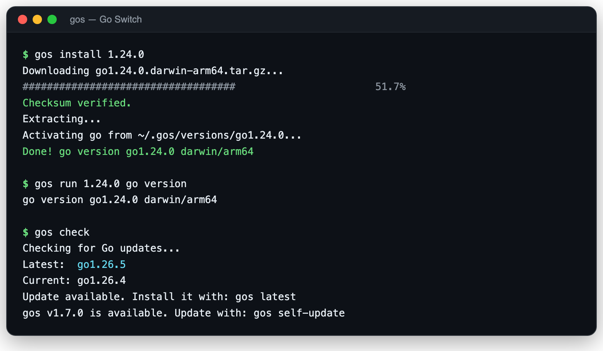

<p align="center">
  <h1 align="center">gos</h1>
  <p align="center">
    <strong>Install and switch Go versions in seconds. One script. Zero dependencies.</strong>
  </p>
  <p align="center">
    <a href="https://github.com/johnny4young/gos/releases"></a>
    <a href="https://github.com/johnny4young/gos/blob/main/LICENSE"></a>
    <a href="https://github.com/johnny4young/gos/actions/workflows/ci.yml"></a>
    <a href="https://scorecard.dev/viewer/?uri=github.com/johnny4young/gos"></a>
    
    
    <a href="https://github.com/johnny4young/gos/stargazers"></a>
  </p>
</p>

---

<p align="center">
  
</p>

---

## Why gos?

You're on Go 1.19. Your project needs 1.22. You just want to switch — not install a version manager that itself needs managing.

**gos** (Go Switch) is a single Bash script that installs and switches Go versions. That's it. No runtimes, no plugins, no config files. It downloads the official binary from [go.dev](https://go.dev/dl/), puts it in place, and gets out of your way.

```bash
gos latest        # installs the latest stable Go
gos install 1.21  # installs a specific version
gos use           # installs the version requested by the current project
gos doctor        # checks your local setup
gos current       # shows what you're running
```

Compare that to the manual way: visit go.dev, find the right archive for your OS and arch, download it, remove the old install, extract, verify. **gos does all of that in one command.**

Works on **macOS**, **Linux**, and **Windows** (via Git Bash or WSL). Auto-detects your OS and CPU architecture. Requires nothing but `curl` and `bash`.

### gos and GOTOOLCHAIN

Since Go 1.21, the `go` command can download a newer toolchain **per module**
when a `go.mod` asks for one (`GOTOOLCHAIN`). That is great for forward
compatibility, but it is a different job than gos does, and the two compose:

- GOTOOLCHAIN needs a Go **already installed** (1.21+) to work at all — gos
  installs that first Go, on a machine that has none.
- GOTOOLCHAIN only ever switches **up** automatically, and only inside a
  module. It doesn't change the `go` on your `PATH`, so `go version` in an
  empty directory still reports whatever you installed — gos is what sets that.
- Downloaded toolchains pile up in the module cache with no per-version cleanup
  (only `go clean -modcache`, all-or-nothing). gos keeps versions side by side
  with `gos list --installed`, `gos uninstall`, and `gos prune`.
- gos verifies every download against go.dev's published checksums, just as the
  `go` command verifies toolchains through the checksum database — so you lose
  no integrity by using gos to manage the global toolchain.

Run `gos doctor` and it will tell you when `GOTOOLCHAIN` is active so the
interaction is never a surprise.

---

## Table of Contents

- [Quick Start](#quick-start)
- [Features](#features)
- [Prerequisites](#prerequisites)
- [Installation](#installation)
  - [curl | bash](#curl--bash)
  - [Homebrew](#homebrew-macos--linux)
  - [PowerShell](#powershell-windows)
  - [Windows Package Managers](#windows-package-managers)
  - [Git Clone](#git-clone)
  - [Manual Shell Config](#manual-shell-configuration)
- [Usage](#usage)
- [Shell Completions](#shell-completions)
- [Exit codes](#exit-codes)
- [Configuration](#configuration)
- [How It Works](#how-it-works)
- [Uninstallation](#uninstallation)
- [Troubleshooting](#troubleshooting)
- [Security](#security)
- [Contributing](#contributing)
- [Releasing](#releasing)
- [License](#license)

---

## Quick Start

```bash
# Install gos
curl -fsSL https://github.com/johnny4young/gos/releases/latest/download/install.sh | bash

# Install the latest stable Go
gos latest
```

Done. That's the whole setup.

---

## Features

- **One command to latest Go** — `gos latest` fetches and installs the newest stable release
- **Pin any version** — `gos install 1.21.6` gets exactly what you need; `gos install 1.21` resolves to the newest patch release
- **Run without switching** — `gos run 1.21 go test ./...` runs a command with a side-by-side Go version without changing the active one; `gos run -- go test ./...` uses the project's pinned version
- **Project-aware switching** — `gos use` reads `.go-version`, `.tool-versions`, `toolchain`, or `go` directives; `gos use --print` resolves without installing and `gos pin` records the active version
- **Update checks** — `gos check` reports whether newer stable Go or `gos` releases are available without installing anything
- **Doctor diagnostics** — `gos doctor` checks Go, PATH, permissions, checksum tools, and extraction tools; `gos doctor --fix` applies only safe, non-destructive fixes
- **Offline status dashboard** — `gos status` summarizes the active Go, project manifest, rollback (and its version), cache size, crash residue, and lock state without network access
- **Cache and rollback** — verified archives are cached, `gos rollback` restores the previous install, and `gos prune` reclaims the disk space; `--dry-run` previews every removal first
- **Concurrent-operation guard** — mutating commands take a portable `.gos-lock` so overlapping installs fail fast instead of racing
- **Side-by-side versions (opt-in)** — set `GOS_VERSIONS_DIR` and every version stays installed; switching becomes an instant symlink flip, with `gos list --installed`, `gos uninstall`, and `gos uninstall --inactive` bulk cleanup
- **One-screen version overview** — `gos list --minor` keeps only the newest release per minor instead of the full 300-line history
- **Shell setup in one line** — `eval "$(gos env)"` puts the managed Go on PATH
- **Opt-in auto-switching** — `eval "$(gos env --auto)"` switches this shell to installed project versions as you `cd`, without changing global symlinks
- **Self-updating** — `gos self-update` upgrades gos itself from the latest verified release
- **Mirror support** — `GOS_DOWNLOAD_MIRROR` downloads archives from an HTTPS mirror while still verifying official go.dev checksums
- **TTY download progress** — interactive installs show archive progress while pipes, CI, and JSON stay quiet
- **Resumable downloads** — an interrupted archive download resumes from where it stopped instead of restarting the whole transfer
- **Test across versions** — `gos each 1.22,1.23,1.24 -- go test ./...` runs a command against several side-by-side versions and prints a pass/fail summary
- **TTY diagnostics styling** — interactive `gos doctor` plus stderr `Error:`/`Warning:` lines use color and symbols; pipes, `NO_COLOR`, `GOS_NO_COLOR=1`, and JSON stay plain
- **Machine-readable output** — `--json` is available for `check`, `current`, `list`, `platforms`, `status`, `which`, `env`, `doctor`, `prune`, `version`, and `use --print`
- **Helpful when you mistype** — unknown commands suggest close matches (`gos isntall` → `install`), and `gos help <command>` shows a single command's usage
- **Auto-detects everything** — OS (`darwin`, `linux`, `windows`, plus FreeBSD/OpenBSD/NetBSD/DragonFly) and architecture (`amd64`, `arm64`, `armv6l`, `386`, `riscv64`, `loong64`, `ppc64le`, `ppc64`, `s390x`)
- **Cross-platform** — macOS, Linux, and Windows (Git Bash / WSL)
- **Zero dependencies** — just `curl` and `bash`, both pre-installed on most systems
- **Shell completions** — tab-completion for Bash, Zsh, and Fish, including dynamic installed/cached version suggestions; `gos completions <shell>` prints them and `gos completions <shell> --install` writes them to the standard per-user directory
- **Man page** — a `gos.1` man page ships with the Homebrew install, so `man gos` documents every command
- **Lightweight** — single shell script, no compilation, no runtime

---

## Prerequisites

| Requirement | Notes |
|---|---|
| `bash` | Pre-installed on macOS and Linux. Use [Git Bash](https://gitforwindows.org/) on Windows. |
| `curl` or `wget` | `curl` is pre-installed on most systems. `wget` is used as fallback. |
| `tar` / `unzip` | `tar` for macOS/Linux, `unzip` for Windows. |
| `sudo` | Required for the default install path (`/usr/local/go`). Not needed if you override `GOS_INSTALL_DIR`. |
| `sha256sum` or `shasum` | Computes the SHA256 of downloads (coreutils on Linux, Perl `shasum` on macOS). Without one gos warns, or fails under `GOS_REQUIRE_CHECKSUM`. |
| `jq` or `python3` (optional) | Parses the go.dev feed for checksums and platform lists; without them gos scrapes the feed and verifies through the `.sha256` companion file. `python3` is pre-installed on macOS. |

> **Windows users:** install with PowerShell or Git Bash. The installed `gos`
> command runs through Git Bash today, so install [Git for Windows](https://gitforwindows.org/)
> or use WSL before running `gos`.

---

## Installation

Choose the method that fits your setup.

### curl | bash

The fastest way to get started:

```bash
curl -fsSL https://github.com/johnny4young/gos/releases/latest/download/install.sh | bash
```

This downloads the latest published `gos` release and places it in `/usr/local/bin`.
The release installer pins the downloaded script to the release asset checksum.
You can customize the location. The installer creates the target directory when
possible:

```bash
curl -fsSL https://github.com/johnny4young/gos/releases/latest/download/install.sh | GOS_BIN_DIR="$HOME/.local/bin" bash
```

If you intentionally want the unreleased development version from `main`, use
the raw GitHub installer instead. This skips the release-pinned checksum path and
should only be used for testing unreleased changes.

```bash
curl -fsSL https://raw.githubusercontent.com/johnny4young/gos/main/install.sh | bash
```

### Homebrew (macOS / Linux)

```bash
brew install johnny4young/tap/gos
```

To upgrade when a new version is released:

```bash
brew upgrade gos
```

> The formula lives in the [johnny4young/homebrew-tap](https://github.com/johnny4young/homebrew-tap) tap and is updated automatically on each release. If you previously installed from the old `johnny4young/gos` tap, Homebrew migrates you to the new tap automatically on your next `brew update` — nothing to do.

### PowerShell (Windows)

PowerShell is the primary Windows install path. Starting with the first release
that ships `install.ps1`, use:

```powershell
irm https://github.com/johnny4young/gos/releases/latest/download/install.ps1 | iex
```

The installer places `gos` in `%LOCALAPPDATA%\Programs\gos`, adds that directory
to your user `PATH`, verifies the release package checksum when installed from a
release asset, and warns if Git Bash is not available. It does not install Go;
after installing `gos`, run `gos latest` or `gos install <version>` when you want
to install a Go toolchain.

To update `gos`, run the same PowerShell installer again:

```powershell
irm https://github.com/johnny4young/gos/releases/latest/download/install.ps1 | iex
```

For development testing before that release asset exists:

```powershell
irm https://raw.githubusercontent.com/johnny4young/gos/main/install.ps1 | iex
```

### Windows Package Managers

Chocolatey and Winget are planned package-manager channels for Windows users,
but PowerShell is the canonical Windows installer first. Their metadata is
maintained under `packaging/` so future package-manager submissions can reuse
the same Windows release asset.

The public `choco install` and `winget install` commands are intentionally not
listed here yet. They should be added only after the packages are accepted by
their registries, so users do not copy commands that fail. Until then, use the
PowerShell installer, Git Bash, or WSL.

### Git Clone

```bash
git clone https://github.com/johnny4young/gos.git ~/.gos
ln -sf "$HOME/.gos/gos.sh" "$HOME/.gos/gos"
```

Then add to your shell profile (see [Manual Shell Configuration](#manual-shell-configuration)):

```bash
export PATH="$HOME/.gos:$PATH"
```

### Manual Shell Configuration

Homebrew installs completion files automatically. For `curl | bash`,
PowerShell, Windows package-manager, or git-clone installs, use the embedded
completion scripts printed by `gos completions <shell>`.

If you installed via git clone, keep the cloned command on `PATH` first:

```bash
export PATH="$HOME/.gos:$PATH"
```

Then add the completion setup for your shell.

**Bash** (`~/.bashrc`):

```bash
mkdir -p "${XDG_CACHE_HOME:-$HOME/.cache}/gos"
gos completions bash > "${XDG_CACHE_HOME:-$HOME/.cache}/gos/gos.bash"
source "${XDG_CACHE_HOME:-$HOME/.cache}/gos/gos.bash"
```

**Zsh** (`~/.zshrc`):

```zsh
mkdir -p "${ZDOTDIR:-$HOME}/.zsh/completions"
gos completions zsh > "${ZDOTDIR:-$HOME}/.zsh/completions/_gos"
fpath=("${ZDOTDIR:-$HOME}/.zsh/completions" $fpath)
autoload -Uz compinit && compinit
```

**Fish** (`~/.config/fish/config.fish`):

```fish
gos completions fish | source
```

After editing, reload your shell:

```bash
source ~/.bashrc   # or ~/.zshrc
exec fish          # for Fish
```

---

## Usage

Bare `gos` prints a three-line status (active Go, project version or no manifest found, next step); `gos help` lists every command by group and `gos help <command>` shows one usage line.

<!-- gos-commands:begin -->
| Command | Description |
|---|---|
| `gos latest` | Install the latest stable Go version |
| `gos install <version> [--from-file <archive> [--sha256 <hex>]]` | Install a specific Go version, optionally from a local archive (air-gapped) verified by an explicit digest |
| `gos rollback [--dry-run]` | Restore the previous Go installation, if available; `--dry-run` only previews the swap |
| `gos uninstall <version or --inactive> [--dry-run]` | Remove an installed version (side-by-side mode); `--inactive` removes all but the active and rollback |
| `gos use [--print [--json]] [path]` | Install the Go version requested by `.go-version`, `.tool-versions`, or `go.mod`; `--print` only resolves it |
| `gos pin [version]` | Write `.go-version` in the current directory (active version by default) |
| `gos run [version] [--] <command> [args...]` | Run a command with a side-by-side Go version without activating it globally; a bare -- uses the project version |
| `gos each <v1,v2,...> [--] <command> [args...]` | Run a command against several side-by-side Go versions and report a pass/fail summary |
| `gos check [--json]` | Check whether newer stable Go or gos releases are available (no install) |
| `gos current [--json]` | Show the currently active Go version |
| `gos list [--installed] [--minor] [--json]` | List available Go versions (or locally installed ones); `--minor` keeps the newest per minor |
| `gos platforms [version] [--json]` | List supported OS/arch archives for a Go version |
| `gos status [--json]` | Show an offline dashboard for gos and the active Go |
| `gos which [version] [--json]` | Show the active or side-by-side Go binary path |
| `gos verify [version] [--json]` | Re-verify an installed Go file by file against the official go.dev archive and its checksum |
| `gos prune [--rollback] [--dry-run] [--json]` | Remove cached Go archives; `--rollback` also removes the rollback copy, `--dry-run` only previews |
| `gos doctor [--fix] [--json]` | Diagnose gos, Go, PATH, and local tool dependencies; `--fix` creates safe missing directories and prints the shell setup line |
| `gos env [--fish] [--auto] [--json]` | Print the PATH setup line or an opt-in per-shell auto-switch hook |
| `gos completions <shell> [--install]` | Print a Bash, Zsh, or Fish completion script (or install it with `--install`) |
| `gos self-update` | Update gos itself to the latest verified release |
| `gos self-verify [--json]` | Verify the running gos script against its release checksums and build attestation |
| `gos version [--json]` | Show gos version |
| `gos help [command]` | Show this help message, or usage for one command |
<!-- gos-commands:end -->

### Examples

```bash
$ gos latest
Fetching latest stable Go version...
Latest: go1.24.1
Current: go1.22.0 -> go1.24.1
Downloading go1.24.1.darwin-arm64.tar.gz...
Checksum verified.
Extracting...
Backing up existing Go installation...
Activating new Go installation...
Rollback available: gos rollback
Done! go version go1.24.1 darwin/arm64

$ gos install 1.21.6
Downloading go1.21.6.linux-amd64.tar.gz...
Checksum verified.
Extracting...
Backing up existing Go installation...
Activating new Go installation...
Rollback available: gos rollback
Done! go version go1.21.6 linux/amd64

$ gos run 1.21.6 go version
go version go1.21.6 darwin/arm64

$ gos use
Using Go 1.21.6 from /path/to/project/.go-version
Already on Go 1.21.6, nothing to do.

$ gos current
go1.24.1

$ gos status
Active:       go1.24.1
Go path:      /usr/local/go/bin/go (managed)
Install dir:  /usr/local/go
Layout:       flat
Project:      go1.24.1 (/path/to/project/.go-version, matches active)
Rollback:     available
Cache:        1 archive(s), 73400320 byte(s) in /Users/alice/.cache/gos
gos:          v1.9.0

$ gos which
/usr/local/go/bin/go

$ gos list
Fetching available Go versions...
go1.22.5
go1.23.2
go1.24rc1
go1.24.1

$ gos doctor --fix
ok - platform: detected darwin/arm64 from Darwin/arm64
ok - install-dir: /usr/local/go can be created or updated
ok - go: /usr/local/go/bin/go reports: go version go1.24.1 darwin/arm64
...
fix - shell setup: export PATH='/usr/local/go/bin':"$PATH"

$ gos check
Checking for Go updates...
Latest:  go1.24.1
Current: go1.24.0
Update available. Install it with: gos latest
gos v1.10.0 is available. Update with: gos self-update

$ gos check --json
{"current":"go1.24.0","latest":"go1.24.1","up_to_date":false,"gos":{"current":"v1.9.0","latest":"v1.10.0","up_to_date":false}}

$ gos current --json
{"found":true,"version":"1.24.1","current":"go1.24.1"}

$ gos status --json
{"active":"go1.24.1","source":"managed","go_path":"/usr/local/go/bin/go","install_dir":"/usr/local/go","layout":"flat","layout_target":null,"project":{"version":"go1.24.1","source":"/path/to/project/.go-version","matches_active":true},"rollback_available":true,"cache":{"dir":"/Users/alice/.cache/gos","archives":1,"bytes":73400320},"gos_version":"1.9.0"}

$ gos self-update
Checking for the latest gos release...
Checksum verified.
gos updated: v1.9.0 -> v1.10.0
```

### Project-aware versions

`gos use` searches from the current directory upward. At each directory level it
prefers `.go-version`, then `.tool-versions` entries named `golang` or `go`,
then a `toolchain goX.Y.Z` directive in `go.mod`, then the `go X.Y` directive.

```bash
gos pin 1.24.1   # writes .go-version
gos use          # installs/switches to that version
```

---

## Shell Completions

Shell completions are included for Bash, Zsh, and Fish. Homebrew installs
completion files automatically; other install methods can load the embedded
scripts from the single `gos` file:

```bash
mkdir -p "${XDG_CACHE_HOME:-$HOME/.cache}/gos"
gos completions bash > "${XDG_CACHE_HOME:-$HOME/.cache}/gos/gos.bash"
source "${XDG_CACHE_HOME:-$HOME/.cache}/gos/gos.bash"
```

For Zsh and Fish setup, see [Manual Shell Configuration](#manual-shell-configuration).

---

## Exit codes

Every failure exits non-zero; the code tells scripts what kind:

| Code | Meaning |
|---|---|
| `0` | Success |
| `1` | Generic failure (installation, activation, or an unexpected state) |
| `2` | Invalid arguments or configuration (unknown option, bad version, unsafe `GOS_*` value) |
| `3` | A download or feed fetch failed (network, go.dev, or the mirror unavailable) |
| `4` | A checksum or release could not be verified (mismatch, missing metadata under `GOS_REQUIRE_CHECKSUM`, unverifiable self-update) |
| `5` | Another gos holds the mutation lock |

With `--json`, a failed command prints one `{"error":{"code":"usage|network|verification|lock|failure","message":"..."}}` document on stdout (the human message still goes to stderr), so a parser never sees an empty stdout. `gos doctor --json` keeps printing its own report and exits `1` when it finds problems; invalid doctor arguments still produce a usage error document. JSON flags on supported commands are recognized before argument/configuration validation regardless of flag order. `gos run` passes through its child command's exit status and arguments (including the child's `--json`); `gos each` keeps exit `1` when any version fails.

## Configuration

<!-- gos-env:begin -->
| Variable | Read by | Default | Description |
|---|---|---|---|
| `GOS_INSTALL_DIR` | `gos` | `/usr/local/go` | Where Go gets installed. Override to install without sudo. Path basename must contain "go". |
| `GOS_VERSIONS_DIR` | `gos` | unset | Opt-in side-by-side layout (e.g. $HOME/.gos/versions). Each version installs to $GOS\_VERSIONS\_DIR/go&lt;version&gt; and GOS\_INSTALL\_DIR becomes a symlink to the active one, so switching is instant. The versions root must not be /, equal to, or inside GOS\_INSTALL\_DIR. Requires symlink support (macOS, Linux, WSL). |
| `GOS_CACHE_DIR` | `gos` | `$XDG_CACHE_HOME/gos` or `$HOME/.cache/gos` | Where verified Go archives, resumable partial downloads, and discovery-only feed metadata are cached. Must be an absolute path. Clear it with gos prune. |
| `GOS_DOWNLOAD_MIRROR` | `gos` | unset | HTTPS base URL to download Go archives from (e.g. https://golang.google.cn/dl behind restrictive networks). Checksums are still resolved from go.dev, and mirror downloads fail closed when they cannot be verified. |
| `GOS_REQUIRE_CHECKSUM` | `gos`, `install.sh`, `install.ps1` | unset | Set to 1 to abort installs when checksum metadata or local SHA256 calculation is unavailable. Set to feed to additionally require the digest to come from the go.dev downloads feed (cross-origin), rejecting the same-origin .sha256 fallback. Honored by gos, install.sh, and install.ps1. Both installers treat feed like 1; install.ps1 rejects unverified main installs under either strict policy. |
| `GOS_FEED_TTL` | `gos` | `600` | Non-negative integer seconds that discovery commands (list, platforms, check, bare-minor resolution, shell completion suggestions) may reuse cached feed metadata. Set to 0 to disable. Invalid values fail before remote discovery and are reported by gos doctor; checksum verification always fetches fresh metadata. |
| `GOS_NO_COLOR` | `gos` | unset | Set to 1 to disable interactive color and symbol styling. |
| `NO_COLOR` | `gos` | unset | The standard no-color convention: when set to a non-empty value, color and symbols are disabled (same as GOS\_NO\_COLOR=1). |
| `TERM` | `gos` | from the terminal | TERM=dumb disables color and symbols; output is never colored when it is not a terminal or under --json. |
| `GOTOOLCHAIN` | `gos` | unset | Read only by gos doctor, which explains how a per-module toolchain composes with the go gos manages on PATH. |
| `XDG_CACHE_HOME` | `gos` | `$HOME/.cache` | Base of the default GOS\_CACHE\_DIR. |
| `XDG_DATA_HOME` | `gos` | `$HOME/.local/share` | Where gos completions bash --install and zsh --install write their files (bash-completion/completions/gos, zsh/site-functions/\_gos). |
| `XDG_CONFIG_HOME` | `gos` | `$HOME/.config` | Where gos completions fish --install writes fish/completions/gos.fish. |
| `GOS_BIN_DIR` | `install.sh` | `/usr/local/bin` | Where the gos command is installed by install.sh. Missing custom directories are created when possible. |
| `GOS_HOME` | `install.ps1`, `packaging/windows/uninstall.ps1` | `%LOCALAPPDATA%\Programs\gos` | Where install.ps1 puts gos on Windows, and what uninstall.ps1 removes. The only way to choose the directory with the irm ... iex one-liner, which cannot pass parameters. |
| `GOS_WINDOWS_PACKAGE_PATH` | `install.ps1` | unset | Install from a local gos-windows.zip instead of downloading it (same as -PackagePath). |
| `GOS_WINDOWS_PACKAGE_SHA256` | `install.ps1` | unset | Expected SHA256 of a local package given with GOS\_WINDOWS\_PACKAGE\_PATH (same as -ExpectedSha256); without it the local package is installed unverified with a warning. |
<!-- gos-env:end -->

Example — install Go in your home directory (no sudo needed):

```bash
export GOS_INSTALL_DIR="$HOME/.go"
gos latest
```

Add the export to your shell profile to make it permanent, or generate the
PATH line with `gos env`:

```bash
eval "$(gos env)"          # bash / zsh
gos env --fish | source    # fish
```

For per-shell project auto-switching, enable the hook explicitly after setting
`GOS_VERSIONS_DIR`:

```bash
eval "$(gos env --auto)"        # bash / zsh
gos env --auto --fish | source  # fish
```

The hook is offline and only changes the current shell's `PATH` when the
project version is already installed under `GOS_VERSIONS_DIR`. A bare minor
such as `go 1.24` in `go.mod` is satisfied by the installed `go1.24.x` (when
exactly one is installed). If the version is missing, it prints a one-line
hint to run `gos use`; it never edits shell startup files or repoints the
global `GOS_INSTALL_DIR` symlink.

> **Note:** For safety, `GOS_INSTALL_DIR` must have at least 2 path components and the basename must contain "go" (e.g. `mygo`, `golang`, `.go` all work). System-critical paths like `/usr` or `/etc` are rejected.

### Side-by-side versions

By default gos keeps exactly one Go under `GOS_INSTALL_DIR` and swaps it in
place. Set `GOS_VERSIONS_DIR` to keep every installed version and switch
instantly:

```bash
export GOS_INSTALL_DIR="$HOME/.gos/go"
export GOS_VERSIONS_DIR="$HOME/.gos/versions"

gos install 1.24.0    # installs to ~/.gos/versions/go1.24.0, links ~/.gos/go
gos latest            # installs the newest release side by side and re-links
gos install 1.24.0    # instant: just repoints the symlink, no download
gos list --installed  # go1.24.0, go1.25.1, ...
gos uninstall 1.24.0  # removes an inactive version
```

`GOS_INSTALL_DIR` becomes a symlink to the active version, so your PATH entry
(`$GOS_INSTALL_DIR/bin`) never changes. `gos use` gains the same instant
switching for project versions that are already installed. Requires a
filesystem with symlinks (macOS, Linux, WSL — not Git Bash).

Keep `GOS_INSTALL_DIR` and `GOS_VERSIONS_DIR` as siblings, as in the example.
gos rejects root-level version directories and any versions root equal to or
inside the active install slot, because activation moves that slot atomically.

---

### Air-gapped installs

Hosts without access to go.dev can install from an archive copied over by hand. `gos install` takes the same version plus the archive, and applies the same trust rules as a download:

```bash
# On a connected machine: fetch the archive and its official digest
curl -fsSLO https://go.dev/dl/go1.26.1.linux-amd64.tar.gz
curl -fsSL https://go.dev/dl/go1.26.1.linux-amd64.tar.gz.sha256

# On the air-gapped host
gos install 1.26.1 --from-file ./go1.26.1.linux-amd64.tar.gz --sha256 <digest>
```

- `--sha256` is the digest gos verifies the file against; with it, nothing is fetched from the network.
- Without `--sha256`, gos looks the digest up in the go.dev feed like a normal install. If that fails, the install follows `GOS_REQUIRE_CHECKSUM`: a warning by default, a refusal (exit `4`) under `GOS_REQUIRE_CHECKSUM=1`.
- The exact version must be given (`1.26.1`, not `1.26`), the archive must match the running OS and architecture, and a verified archive is copied into `GOS_CACHE_DIR` for later reuse.

### Proxies

gos does not open connections itself: `curl` (or `wget`) does, and both honor the standard `HTTPS_PROXY`, `HTTP_PROXY`, and `NO_PROXY` variables. Export them in the shell that runs gos and every download (feed, checksums, archives, self-update) goes through the proxy. `gos doctor` reports the proxy in use so a failing download is diagnosed in one look. A proxy that rewrites responses is caught by the checksum verification, not silently accepted.

## How It Works

1. Queries the [official Go downloads API](https://go.dev/dl/?mode=json) for available versions
2. Detects your OS via `uname -s` and architecture via `uname -m`
3. Downloads the matching archive from `https://go.dev/dl/`, resuming an interrupted transfer instead of restarting it
4. Verifies the SHA256 checksum against the Go downloads feed (uses `jq` or `python3`) — checking the small default feed first and only fetching the full history for older versions — with the archive's published `.sha256` companion file as a fallback when the feed cannot be parsed
5. Reuses a verified cached archive in place when one is present, without re-downloading
6. Extracts the new version into a temporary staging directory
7. Validates the staged `go/bin/go` before touching `$GOS_INSTALL_DIR`
8. Backs up the previous Go installation, activates the staged version, and rolls back automatically if activation fails
9. Keeps the previous install available for `gos rollback`
10. Confirms with `go version`

The default layout uses a real Go directory; opt-in side-by-side mode uses an
activation symlink. Neither mode uses shims.

---

## Uninstallation

### Optional: remove managed Go data first

Removing the `gos` command does **not** remove Go or its cache. If you want
those removed too, do this **before** uninstalling the command. Restore the
same `GOS_*` and XDG overrides used for installation; an unset variable cannot
recover an old custom location. Stop running Go/gos processes first.

In Bash or Zsh, inspect the effective locations and preview the cleanup:

```bash
# gos-uninstall:preview
# Strip trailing slashes so rm removes an activation symlink, not its target.
gos_install_dir="${GOS_INSTALL_DIR:-/usr/local/go}"
gos_install_dir="${gos_install_dir%/}"
gos_versions_dir="${GOS_VERSIONS_DIR:-}"
gos_versions_dir="${gos_versions_dir%/}"
gos_cache_dir="${GOS_CACHE_DIR:-${XDG_CACHE_HOME:-${HOME:-/tmp}/.cache}/gos}"
printf 'Active Go: %s\nVersions (empty = disabled): %s\nCache: %s\n' \
  "$gos_install_dir" "$gos_versions_dir" "$gos_cache_dir"
gos status
gos prune --rollback --dry-run
```

**Stop if a command fails or any path is unexpected.** Only continue after
confirming these are the Go-specific locations you want to delete, not shared
data directories. The following commands prompt before deleting installations;
use `sudo` only for a confirmed root-owned Go path if permission is denied.

```bash
# gos-uninstall:data
gos prune --rollback   # remove known cached archives, feed metadata and rollback/residue
rm -ri -- "$gos_install_dir"
if [ -n "$gos_versions_dir" ]; then
  rm -ri -- "$gos_versions_dir"
fi
# Remove only an empty cache directory; leave any unrelated contents intact.
if [ -d "$gos_cache_dir" ]; then
  rmdir -- "$gos_cache_dir"
fi
# Remove only the three files written by gos completions --install.
rm -i -- "${XDG_DATA_HOME:-$HOME/.local/share}/bash-completion/completions/gos" \
  "${XDG_DATA_HOME:-$HOME/.local/share}/zsh/site-functions/_gos" \
  "${XDG_CONFIG_HOME:-$HOME/.config}/fish/completions/gos.fish"
```

Missing completion files need no cleanup. A non-empty cache directory is left
for manual inspection rather than recursively deleting unrelated files.

### Remove the gos command

Choose the method you originally used:

**If installed via curl | bash:**

```bash
rm -i -- "${GOS_BIN_DIR:-/usr/local/bin}/gos"
# If this confirmed command path is root-owned, repeat with sudo.
```

**If installed via Homebrew:**

```bash
brew uninstall gos
brew untap johnny4young/tap
```

**If installed via PowerShell on Windows:**

```powershell
$gosHome = $env:GOS_HOME
if ([string]::IsNullOrWhiteSpace($gosHome)) {
  $gosHome = Join-Path ([Environment]::GetFolderPath('LocalApplicationData')) 'Programs\gos'
}
# If you installed with -InstallDir, set $gosHome to that original directory.
& (Join-Path $gosHome 'uninstall.ps1') -InstallDir $gosHome
```

**If installed via git clone:** inspect your original clone location and any
uncommitted work before removing it (the quick-start example uses `$HOME/.gos`).
Do not remove that directory wholesale if you keep unrelated files there.

Finally, remove the gos-related `PATH`, `source`, and auto-switch hook lines
from your shell config and open a new terminal.

---

## Troubleshooting

`gos doctor` checks local platform, paths, tools, checksum policy and install
state, with suggested fixes; `gos doctor --json` exposes those diagnostics to
scripts. It does not test network reachability, project-manifest resolution or
the Windows launcher. Use the symptom-specific checks below for those cases.

| Symptom | Cause | Fix |
|---|---|---|
| `go version` still shows the old Go after `gos install` | Another Go is earlier on `PATH` (Homebrew, a manual install) | `gos which` shows which binary wins; put `$GOS_INSTALL_DIR/bin` first, or `eval "$(gos env)"` |
| `Error: another gos operation is running` | A previous gos was interrupted, or one is running | `gos status` shows the lock and its pid; remove `${GOS_INSTALL_DIR:-/usr/local/go}.gos-lock` only after verifying no gos operation is running (strip any trailing slash from the install path first) |
| `Residue:` or `Orphaned backup found` in `gos status` | An install was interrupted between renames | `gos prune --rollback` removes the residue once the active Go works |
| `Rollback: broken link` | The side-by-side version the rollback pointed at was uninstalled | `gos prune --rollback`; the next install creates a new rollback |
| Password prompt on every install | `GOS_INSTALL_DIR` is root-owned (`/usr/local/go`) | Set `GOS_INSTALL_DIR` under your home directory; gos only escalates for the directory it writes |
| `checksum verification required but ...` (exit 4) | `GOS_REQUIRE_CHECKSUM` is set and `jq`/`python3` or a SHA256 tool is missing | Install `jq` or `python3` plus `sha256sum`/`shasum`, then retry; check feed availability and the diagnostic before changing verification policy |
| `could not fetch ...` (exit 3) | go.dev, the mirror, or a proxy is unreachable | Check `HTTPS_PROXY`; `GOS_DOWNLOAD_MIRROR` moves only archive downloads, metadata always comes from go.dev |
| No network at all | Air-gapped host | Copy the archive over and run `gos install <version> --from-file <archive> --sha256 <digest>` (see [Air-gapped installs](#air-gapped-installs)) |
| `gos requires Git Bash` on Windows | Only the WSL launcher `bash.exe` is installed | Install Git for Windows, or run gos inside WSL |
| `go 1.24` in `go.mod` but the hook says it is not installed | No `go1.24.x` is installed, or several are | `gos use` installs one; with several installed, pin an exact version with `gos pin` |
| `GOTOOLCHAIN` warning in `gos doctor` | The Go toolchain may run a per-module version instead of the one on `PATH` | Expected; set `GOTOOLCHAIN=local` to always use the managed Go |

## Security

Security reporting instructions, supported versions, and installer trust
assumptions are documented in [SECURITY.md](SECURITY.md). Do not open public
issues for sensitive vulnerability details.

### Verifying what you run

Two commands re-check what is already on disk against the published sources of truth:

```bash
# Compare every file the official go1.26.1 archive ships with the installed copy
gos verify            # the managed Go
gos verify 1.25.3     # any side-by-side version

# Compare the running gos script with the checksums (and build attestation) of its release
gos self-verify
```

`gos verify` obtains the archive the same way an install does (cache first, checksum from the go.dev feed), extracts it to a temporary directory, and lists every shipped file that is modified or missing; extra files the install gained (build caches) are ignored. `gos self-verify` fetches the `checksums.txt` of the release matching the running version, and, when the GitHub CLI is installed and authenticated, also runs `gh attestation verify`. Both exit `4` when something does not match and support `--json`.

---

## Contributing

Start with [docs/ARCHITECTURE.md](docs/ARCHITECTURE.md) for a map of the
script, the install transaction, and the bash 3.2 rules.

Contributions are welcome. Start with [CONTRIBUTING.md](CONTRIBUTING.md) for
setup, issue reporting, validation commands, and pull request expectations.

Community support options are documented in [SUPPORT.md](SUPPORT.md), and all
participation follows the [Code of Conduct](CODE_OF_CONDUCT.md).

Please open an issue or discussion first for major changes so the approach can
be reviewed before implementation.

## Releasing

Maintainer release steps are documented in [RELEASING.md](RELEASING.md). Use it
to keep GitHub release assets, Homebrew, PowerShell, package metadata, README
install commands, and changelog links in sync.

---

## License

This project is licensed under the [MIT License](LICENSE).

---

<p align="center">
  Built for Go developers who'd rather write code than manage installations.
</p>
